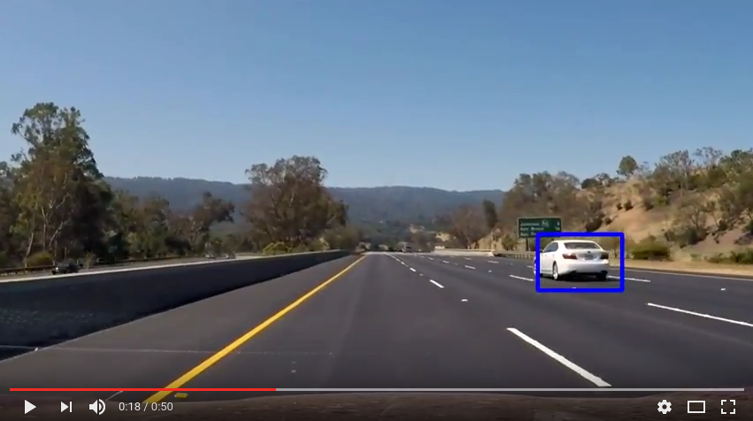

# Self-Driving Car Engineer Nanodegree
# OpenCV and State Vector Machine
## Project: track vehicles on road and place bounding box

### Overview

This project is a software pipeline to detect vehicles in a video. A detailed writeup of the solution as well as sample images of different stages of the pipeline is available in `writeup_submission.md`

The Project
---

The goals / steps of this project are the following:

* Perform a Histogram of Oriented Gradients (HOG) feature extraction on a labeled training set of images and train a classifier Linear SVM classifier
* Optionally, apply a color transform and append binned color features, as well as histograms of color, to your HOG feature vector. 
* Note: for first two steps features are normalized and a selection for training and testing is randomized.
* Implement a sliding-window technique and use your trained classifier to search for vehicles in images.
* Run pipeline on a video stream (start with the test_video.mp4 and later implement on full project_video.mp4) and create a heat map of recurring detections frame by frame to reject outliers and follow detected vehicles.
* Estimate a bounding box for vehicles detected.

Here are links to the labeled data for [vehicle](https://s3.amazonaws.com/udacity-sdc/Vehicle_Tracking/vehicles.zip) and [non-vehicle](https://s3.amazonaws.com/udacity-sdc/Vehicle_Tracking/non-vehicles.zip) examples to train your classifier.  These example images come from a combination of the [GTI vehicle image database](http://www.gti.ssr.upm.es/data/Vehicle_database.html), the [KITTI vision benchmark suite](http://www.cvlibs.net/datasets/kitti/), and examples extracted from the project video itself.   You are welcome and encouraged to take advantage of the recently released [Udacity labeled dataset](https://github.com/udacity/self-driving-car/tree/master/annotations) to augment your training data.  

Some example images for testing your pipeline on single frames are located in the `test_images` folder.

Files
---
* `utils.py` - utility and helper functions as well as feature extractors
* `buildCLF.py` - builds and trains a linear SVM classifier
* `trackerDriver.py` - main application entry and driver
* `vehicleTracker.ipynb` - python notebook used for visualization and testing